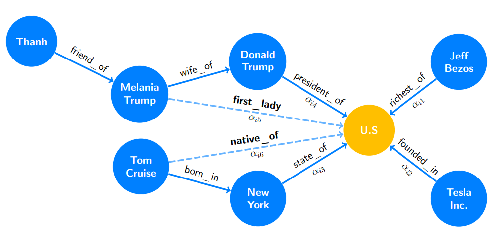

# Graph Embedding in Knowledge Graph

TransE (initiation) -> KBGAT (encoder) -> ConvKB (decoder) -> Evaluation

## Knowlege Graph
Example



* `train.txt`
```python
Melania_Trump wife_of Donald_Trump
Donald_Trump president_of U.S
Jeff_Bezos richest_of U.S
Tom_Cruise born_in New_York
New_York state_of U.S
Tesla_Inc founded_in U.S
Melania_Trump first_lady U.S
Tom_Cruise native_of U.S
Thanh friend_of Melania_Trump
```
* `entity2id.txt`
```python
Melania_Trump	0
Donald_Trump	1 
U.S				2
Jeff_Bezos		3
Tom_Cruise		4
New_York		5
Tesla_Inc		6
Thanh			7
```

* `relation2id.txt`
```python
wife_of			0
president_of	1
richest_of		2
born_in			3
state_of		4
founded_in		5
first_lady		6
native_of		7
friend_of		8
```

->
```python
[0 0 1] 
[1 1 2] 
[3 2 2] 
[4 3 5] 
[5 4 2] 
[6 5 2] 
[0 6 2] 
[4 7 2] 
[7 8 0]
```
-->

```python
tensor([[5, 4, 2],
        [4, 7, 2],
        [4, 3, 5],
        [1, 1, 2],
        [0, 0, 1],
        [0, 6, 2],
        [7, 8, 0],
        [3, 2, 2],
        [6, 5, 2],
        [1, 4, 2],
        [0, 7, 2],
        [6, 3, 5],
        [2, 1, 2],
        [7, 0, 1],
        [6, 6, 2],
        [1, 8, 0],
        [7, 2, 2],
        [1, 5, 2],
        [5, 4, 1],
        [4, 7, 4],
        [4, 3, 2],
        [1, 1, 7],
        [0, 0, 4],
        [0, 6, 0],
        [7, 8, 6],
        [3, 2, 5],
        [6, 5, 6]])
```

### TransE


### Model KBGAT (encoder)

Layers

```python
SpKBGATModified(
  (sparse_gat_1): SpGAT(
    (dropout_layer): Dropout(p=0.3, inplace=False)
    (attention_0): SpGraphAttentionLayer (3 -> 100)
    (attention_1): SpGraphAttentionLayer (3 -> 100)
    (out_att): SpGraphAttentionLayer (200 -> 200)
  )
)
```

Architecture
```python
final_entity_embeddings : torch.Size([8, 200])
final_relation_embeddings : torch.Size([9, 200])
entity_embeddings : torch.Size([8, 3])
relation_embeddings : torch.Size([9, 3])
W_entities : torch.Size([3, 200])
sparse_gat_1.W : torch.Size([3, 200])
sparse_gat_1.attention_0.a : torch.Size([100, 9])
sparse_gat_1.attention_0.a_2 : torch.Size([1, 100])
sparse_gat_1.attention_1.a : torch.Size([100, 9])
sparse_gat_1.attention_1.a_2 : torch.Size([1, 100])
sparse_gat_1.out_att.a : torch.Size([200, 600])
sparse_gat_1.out_att.a_2 : torch.Size([1, 200])
```

### Model ConvKB (decoder)

Layers

```python
SpKBGATConvOnly(
  (convKB): ConvKB(
    (conv_layer): Conv2d(1, 500, kernel_size=(1, 3), stride=(1, 1))
    (dropout): Dropout(p=0.0, inplace=False)
    (non_linearity): ReLU()
    (fc_layer): Linear(in_features=100000, out_features=1, bias=True)
  )
)
```

Architecture
```
final_entity_embeddings : torch.Size([8, 200])
final_relation_embeddings : torch.Size([9, 200])
convKB.conv_layer.weight : torch.Size([500, 1, 1, 3])
convKB.conv_layer.bias : torch.Size([500])
convKB.fc_layer.weight : torch.Size([1, 100000])
convKB.fc_layer.bias : torch.Size([1])
```

# Question

Mô hình bao gồm 3 bước :
1. Huấn luyện các vector nhúng thực thể và quan hệ bằng mô hình TransE, sử dụng hàm mất mát MarginRankingLoss (Hing-loss) để tính khoảng cách giữa chúng.
2. Tiếp tục sử dụng các vector nhúng thực thể và quan hệ bằng mô hình KBGAT, sử dụng hàm mất mát MarginRankingLoss (Hing-loss).
3. Sử dụng các vector nhúng đã học để đi qua lớp ConvKB để tính xác xuất của các vector nhúng. Sử dụng hàm mất mát SoftMarginLoss

### 1. MarginRankingLoss : Được đạo hàm như thế nào
https://pytorch.org/docs/stable/generated/torch.nn.MarginRankingLoss.html


### 2. SoftMarginLoss : Được đạo hàm như thế nào
https://pytorch.org/docs/stable/generated/torch.nn.SoftMarginLoss.html


